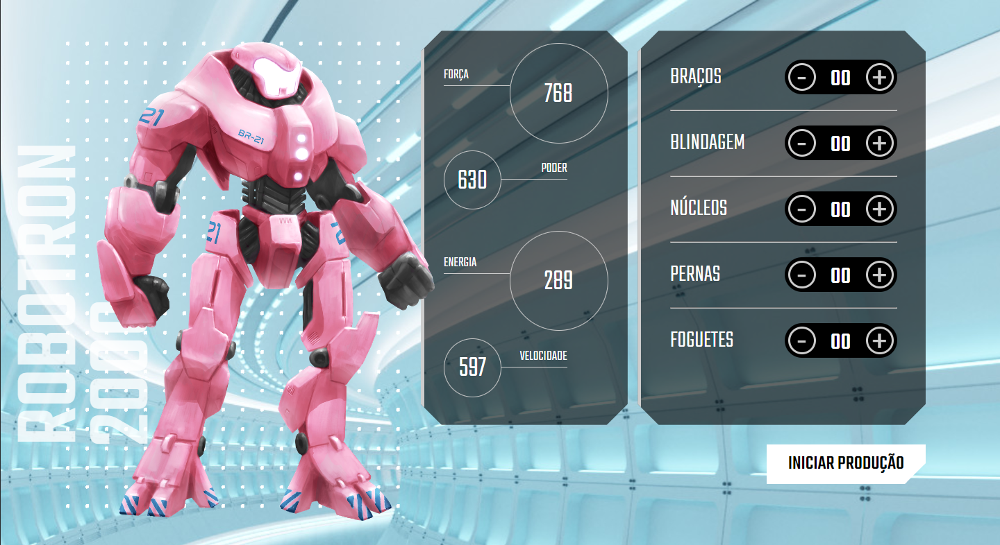

# Robotron 2000 | JavaScript: manipulando o DOM

Este repositório contém o projeto Robotron 2000 desenvolvido durante o curso "JavaScript: manipulando o DOM" oferecido pela [Alura](https://www.alura.com.br/) Escola Online de Tecnologia.

## 📁 Detalhes do projeto

	

 

O Robotron 2000 consiste em um formulário de montagem de um robô, onde o usuário pode interagir escolhendo como equipar seu personagem e ver as estatísticas de força, poder, energia e velocidade serem atualizadas em tempo real.

O commit initial project é referente aos arquivos HTML e CSS disponibilizados pelo instrutor do curso.

## 📚 Temas abordados

* Selecionar e manipular elementos do DOM;
* Método `addEventListener()` para escutar eventos;
* Funções declaradas, anônimas e arrow function;
* Uso de Data Attributes;
* Manipular objetos de uma array;
* Laços de repetição com `forEach()`.

## 🖥️ Acesso ao projeto

<a href="https://robotron-six-mu.vercel.app/" target="_blank">Clique aqui</a> para acessar o Robotron no seu navegador.

Após abrir o projeto basta clicar nos botões de mais e menos em cada peça e equipar o seu robô.

## 👩‍💻 Tecnologias utilizadas

	
	
	

Desenvolvido com 💙 por [Juliana Lucca](https://www.linkedin.com/in/julianalucca/)